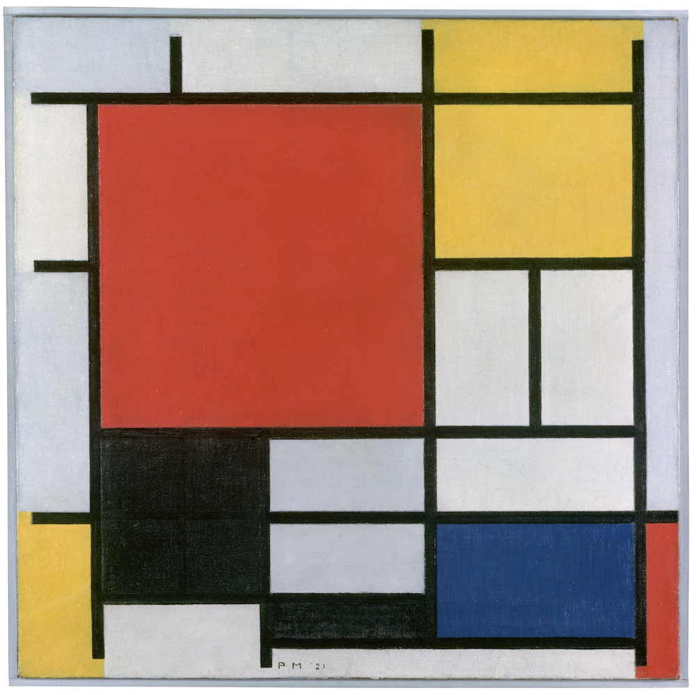

# jili0710_9103_major_project
# Mondrian-Inspired Interactive Animation (Perlin Noise & Random Value)
## How to Interact with the Work

1. After opening the webpage, the animation starts automatically.
2. Press the `Spacebar` to toggle "flashing mode", which causes some blocks to randomly change their transparency. Press again to turn it off.
3. Press the `Return` key to restore the transparency of all blocks to default.
4. Click the buttons at the top of the page:
   - `NORMAL`: Blocks return to normal size, background becomes black.
   - `SMALL`: Blocks shrink with a breathing animation, background becomes dynamically yellow.
   - `LARGE`: Blocks enlarge, background becomes white.

---

## Animation Approach

I chose to animate using **Perlin noise** and **random values**.

---

## What Makes My Animation Unique

My section makes each block "breathe" using a smooth Perlin noise-driven scaling effect to mimic the rhythm of Boogie Woogie jazz. I also added a block flashing mode, using `random()` to change transparency, controlled by keyboard. The background color gradually changes or switches based on user input—this combination of scale, opacity, and background behavior makes my work distinct.

---

## Inspiration

I drew inspiration from various phases of Piet Mondrian's artistic evolution:
- The `SMALL` button mode reflects his famous **"Broadway Boogie Woogie"**

- The `NORMAL` mode references **"Composition with Red, Yellow and Blue"**

- The `LARGE` mode draws from his early geometric work **"Composition with Colour Planes and Gray Lines 1" (1917)**

---

## Technical Breakdown

1. Each grid square stores a `noiseOffset` value and uses `frameCount` + `noise()` to calculate scaling in `draw()`.
2. `random()` controls alpha changes for flashing behavior.
3. Background color is animated via Perlin noise or switched using a `bgMode` state.
4. `createButton()` is used to make interactive UI for size/background modes.

---

## Changes Made to Group Code

1. Removed `noLoop()` to enable continuous animation.
2. Removed stroke borders from the blocks.
3. Added `alpha` property to each block.
4. Added `bgMode` logic for background switching.
5. Introduced `scaleMin` and `scaleMax` variables to control animation range via buttons.

---

## Use of External Techniques

I used the `while()` loop structure for grid generation, which I discovered while exploring examples on the official p5.js website. (https://p5js.org/reference/p5/while/) ChatGPT later recommended adapting it into my composition logic. This is because each row contains rectangles of random widths, making it impossible to predetermine the number of blocks. Compared to a `for()` loop, a `while()` loop is more flexible for filling the canvas dynamically with irregular layouts.

